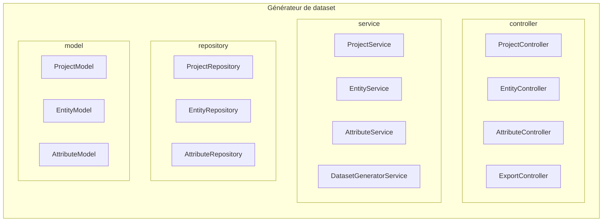

# Générateur de Datasets

Application web développée avec Spring Boot, Thymeleaf et H2, permettant de définir des modèles de données (projets, entités, attributs), de générer des datasets fictifs et de les exporter au format JSON et CSV.

## Objectif du projet

Ce projet vise à construire une application capable de :

* Définir des projets de génération de données

* Définir des entités et leurs attributs

* Organiser les entités en hiérarchie (sous-entités)

* Générer des données fictives cohérentes

* Exporter les datasets en JSON et CSV

* Proposer une interface web simple et intuitive

## Technologies utilisées


* Java 23

* Spring Boot

* Spring Web (MVC & REST)

* Spring Data JPA

* Thymeleaf

* H2 Database

* Gradle

* Bootstrap 5

* Swagger / OpenAPI

## Instructions de build et d’exécution

### 1. Prérequis

* Java 17+

* Gradle

### 2. Lancer l’application

```bash
./gradlew bootRun
```

L’application démarre sur :

```arduino
http://localhost:8081
```

### 3. Accès aux interfaces

| Fonction      | URL                                                                                        |
| ------------- | ------------------------------------------------------------------------------------------ |
| Accueil | [http://localhost:8081](http://localhost:8081)                                             |
| Projets       | [http://localhost:8081/projects](http://localhost:8081/projects)                           |
| Entités       | [http://localhost:8081/entities](http://localhost:8081/entities)                           |
| Attributs     | [http://localhost:8081/attributes](http://localhost:8081/attributes)                       |
| Swagger UI    | [http://localhost:8081/swagger-ui/index.html](http://localhost:8081/swagger-ui/index.html) |
| Console H2    | [http://localhost:8081/h2-console](http://localhost:8081/h2-console)                       |

### Configuration H2

* **JDBC URL** : jdbc:h2:mem:myH2Database

* **Username** : sa

* **Password** : (vide)

## Exemple de jeu de données généré

### Exemple JSON exporté

```json
{
  "projectName": "MyProject",
  "records": [
    {
      "Personne": {
        "nom": "Windler",
        "prenom": "Fred",
        "age": 2,
        "ville": "North Dustymouth"
      }
    },
    {
      "Personne": {
        "nom": "Mraz",
        "prenom": "Zana",
        "age": 53,
        "ville": "Armandland"
      }
    },
    {
      "Personne": {
        "nom": "Spencer",
        "prenom": "Jackson",
        "age": 54,
        "ville": "Lesleyborough"
      }
}
```

Les données sont générées dynamiquement selon :

* Les types d’attributs

* Les contraintes (min, max, length)

* La hiérarchie des entités

## Interface utilisateur (Front)

### Pages disponibles

* **Home** : présentation du projet


* **Projects** : création / édition / suppression de projets


* **Entities** : gestion des entités et sous-entités


* **Attributes** : gestion des attributs


* **PreviewJson** : visualisation JSON avant export


* **ExportJson** : téléchargement JSON


* **Swagger** : Test des endpoints


## Architecture du projet

```text
src/main/java/com/example/projetfinaltest
 ├── controller
 │   ├── MVC
 │   └── Rest
 ├── service
 │   ├── basicServices
 │   ├── export
 │   └── preset
 ├── repository
 ├── model
 ├── dto
 ├── mapper
 └── config
 └── templates
```

## Diagramme d'architecture



## Documentation API

La documentation des endpoints REST est disponible via Swagger :

```bash
http://localhost:8081/swagger-ui/index.html
```

### Auteur

Mahoua Aude Camara
Master BIHAR, ESTIA
Projet académique – 2025


